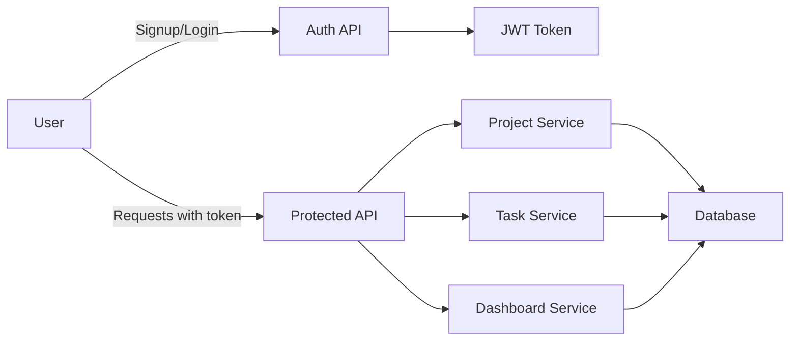

# Team Task Manager Application Flow

This document explains the end-to-end flow for the Team Task Manager application, aligned to the assignment requirements.

## User Journey

1. User visits the web application.
2. User signs up with name, email, and password.
3. User logs in and receives a JWT token.

4. User creates a project or joins an existing project when added by an Admin.
5. The project creator becomes the Admin for that project.
6. Project Admin adds or removes members from the project.
7. Members create tasks, assign tasks to users, and update task status.
8. Dashboard displays metrics: total tasks, tasks by status, tasks per user, and overdue tasks.

## System Flow

### Authentication

- User sends credentials to `/api/auth/signup` or `/api/auth/login`.
- Backend validates input and stores hashed passwords.
- Backend issues a JWT on successful login.
- Client stores token securely (e.g. `localStorage` or secure cookie).
- Protected requests include `Authorization: Bearer <token>`.
- There is one login flow for all users; no separate admin login panel is required.

### Project Management

- User creates a project via `POST /api/projects`.
- Backend creates the project record and assigns the creator as project Admin.
- The creator does not need a separate login screen or special account type.
- Admin can add members to the project via `POST /api/projects/:projectId/members`.
- Members can view only the projects they are assigned to.
- Project membership includes a role of `Admin` or `Member` for each project.

### Task Management

- Admin or authorized member creates a task inside a project.
- Task payload includes title, description, due date, priority, and assignee.
- Status values are: `To Do`, `In Progress`, `Done`.
- Priority values are: `low`, `medium`, `high`.
- Backend verifies that the assignee belongs to the project before creating the task.
- Members can update the status of tasks assigned to them.

### Dashboard

- Dashboard API aggregates project and task metrics for the authenticated user.
- Metrics include total tasks, tasks by status, tasks per user, and overdue tasks.
- Frontend renders charts, cards, and tables for quick progress tracking.

## Data Flow Diagram

## Entity Relationships

- Users can belong to multiple projects.
- Projects can contain multiple tasks.
- Tasks are assigned to one user.
- Each project membership has a role: `Admin` or `Member`.

## Example Request Flow

1. Create project
   - `POST /api/projects`
   - Response returns project details and creator admin membership.
2. Add member
   - `POST /api/projects/:projectId/members`
   - Response confirms the added member.
3. Create task
   - `POST /api/projects/:projectId/tasks`
   - Response returns task information.
4. Update task
   - `PATCH /api/tasks/:taskId`
   - Response returns updated task.
5. Dashboard
   - `GET /api/dashboard`
   - Response returns aggregated metrics.

## Access Control Rules

- Admins can:
  - Create projects
  - Add or remove members
  - Manage all project tasks
- Members can:
  - View assigned projects
  - View assigned tasks
  - Update the status of tasks assigned to them
  - Cannot manage project membership

## Error Handling

- Return clear HTTP status codes:
  - `400` for validation errors
  - `401` for authentication failure
  - `403` for forbidden access
  - `404` for missing resources
  - `500` for server errors

## Notes on Deployment

- Use Railway for hosting both frontend and backend.
- Set environment variables in deployment settings.
- Ensure CORS is configured so frontend can communicate with backend.

## Recommended Next Steps

- Implement database migrations for the data model.
- Build backend routes and middleware for auth and RBAC.
- Create frontend pages for login, project list, project details, task board, and dashboard.
- Add project membership and role-based UI controls.
